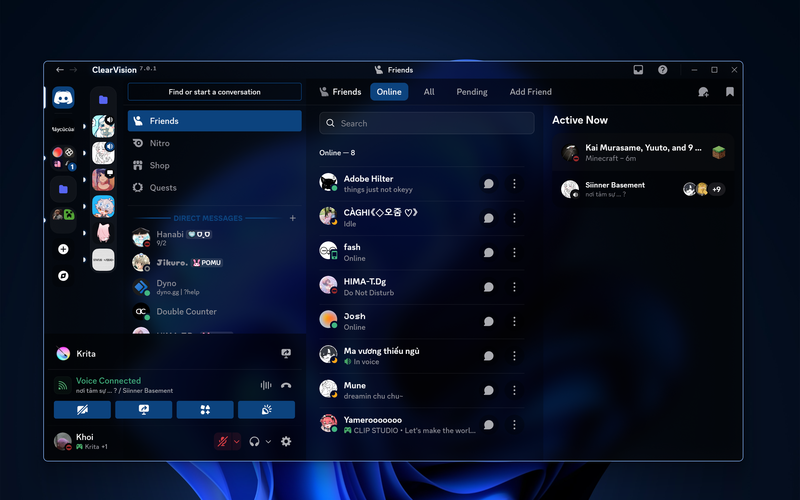

## Transparent Better Discord Theme

**Transparent Discord Theme** is my personal theme that boost my productivity, using [**Mica for Everyone**](https://github.com/MicaForEveryone/MicaForEveryone/releases) and [Vencord](https://vencord.dev/).

---
> [!TUTORIAL]
> You can read [this article](https://www.reddit.com/r/BetterDiscord/comments/1065blb/using_mica_for_everyone_for_transparent_discord/) and follow the steps
> Then install my theme
